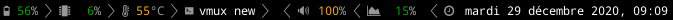
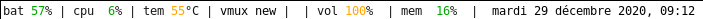

# umberbar

:ram: minimalistic xmobar inspired status bar, in terminal. 

# prerequisites 

for black and white theme, you need [nerdfonts](https://www.nerdfonts.com/) installed, as well as xterm.

## using it

launch with xterm, specifying which theme you want to use.

./umberbar.sh xterm black.theme

./umberbar.sh xterm white-no-nerd.theme
