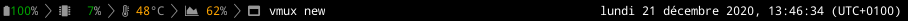

# umberbar

:ram: minimalistic xmobar inspired status bar, in terminal. 

# prerequisites 

you need [nerdfonts](https://www.nerdfonts.com/) installed, as well as xterm.

## using it

`./umberbar.sh xterm
