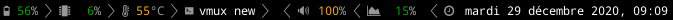
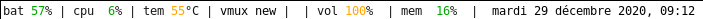

# umberbar 🐏  

minimalistic xmobar inspired status bar, in xterm. 






If you want a window manager that plays along well with it, have a look at [umberwm](https://github.com/yazgoo/umberwm/).

## prerequisites 

- for black (default) and white theme, you need [nerdfonts](https://www.nerdfonts.com/) installed
- you need xterm installed
- you need xrandr

## downloading

Binaries are available on [release page](https://github.com/yazgoo/umberbar/releases)

## configuration

By default, umberbar will create `~/.config/umberbar.conf` with default theme.
To select a different theme use `-t <theme_name>` and to save it it to the configuration use `-s` (`-h` for more help).

## running from binaries

```
./umberbar
``` 

## building / running it (crystal)

```
crystal build umberbar.cr
```

```
./umberbar
```

## running it (ruby)

```
./umberbar.rb
```
## why does this project use crystal ?

crystal gives this project many advantages:

- type safety (because type checking makes everything safer and easier to reason with)
- nil protection (which is part of the type safety I guess)
- because we compile for crystal, those guarantees also translate to ruby runtime
- self contained binaries

## what are the painpoints of developing for both ruby and crystal ?

Although both languages are really close, crystal is not made to be compatible with ruby.
This project uses the lowest common denominator between those (so no macro, no introspection).
Where there were incompatibilites, we used the method `is_ruby?`.

Here is a list of incompatibilities and how we handle those:

  - `Time.now` does not exist in crystal so we use `date` command in ruby
  - `Process.exec` does not have the same exact interface
  - umberbar calls itself in xterm, we use `__FILE__` in ruby, `PROGRAM_NAME` in crystal
